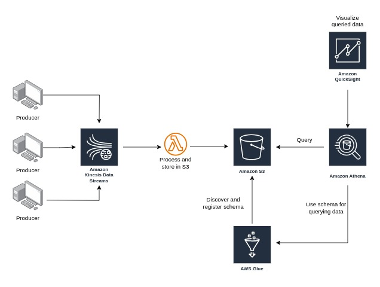
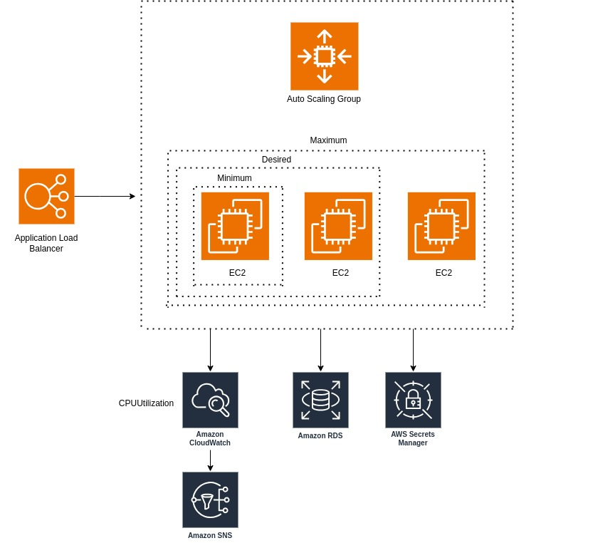
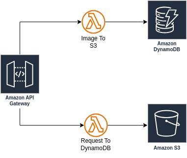
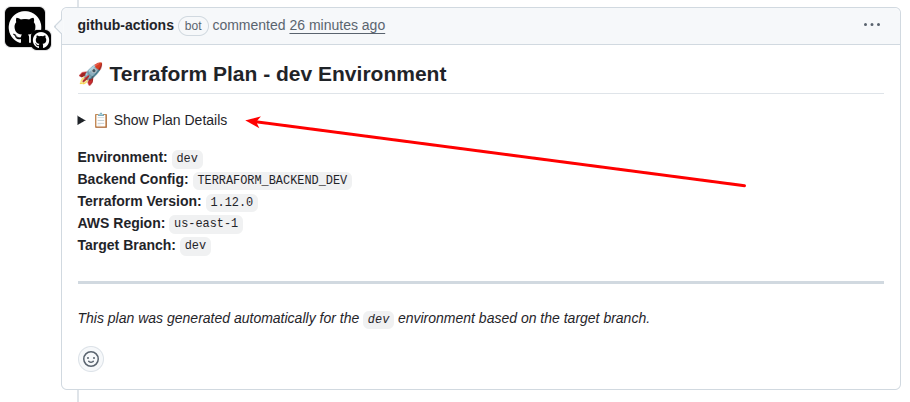
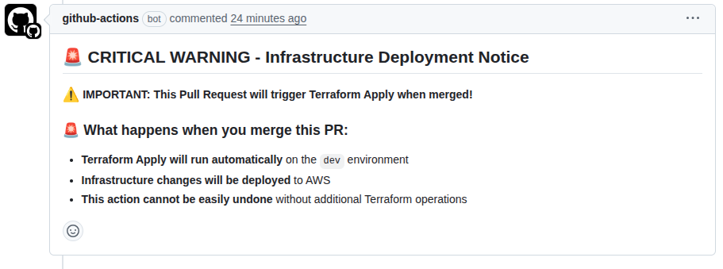
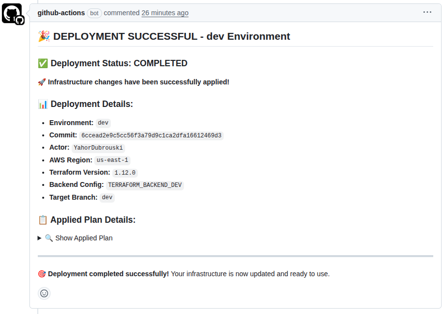
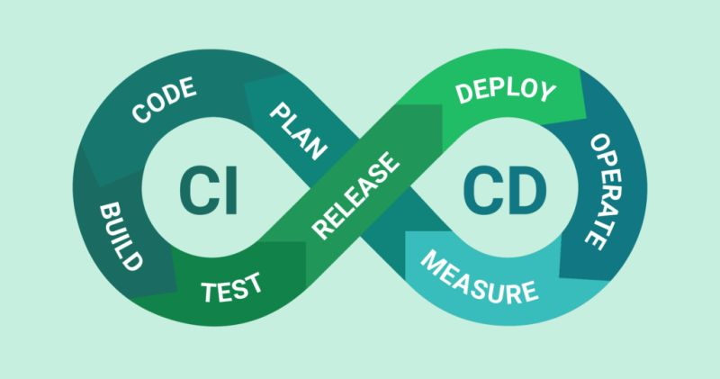
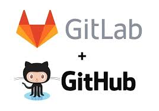
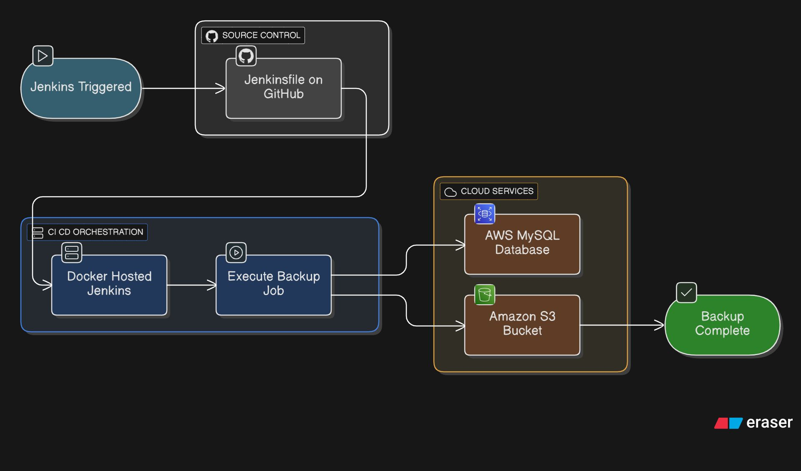

# DevOps Portfolio

**AWS | Terraform | CI/CD | Infrastructure as Code**

---

## 🚀 AWS Projects

### Real-Time Data Processing

**Architecture:** Kinesis Data Streams → Lambda → S3 → Glue → Athena → QuickSight  
**Services:** Kinesis, Lambda, S3, Glue, Athena, QuickSight  
**Features:** Real-time data ingestion, schema discovery, analytics visualization

**🔗 [View Project →](https://github.com/YahorDubrouski/AWS/tree/main/real-time-data-processing)**

---

### Scalable Web Application

**Architecture:** Application Load Balancer → Auto Scaling Group → EC2 → RDS  
**Services:** ALB, ASG, EC2, RDS, CloudWatch  
**Features:** High availability, auto-scaling, fault tolerance, monitoring

**🔗 [View Project →](https://github.com/YahorDubrouski/AWS/tree/main/scalable-web-application)**

---

### Serverless Application

**Architecture:** API Gateway → Lambda → DynamoDB & S3  
**Services:** API Gateway, Lambda, DynamoDB, S3  
**Features:** Serverless architecture, cost optimization with lifecycle policies

**🔗 [View Project →](https://github.com/YahorDubrouski/AWS/tree/main/serverless-application)**

**📁 [View AWS Projects Repository →](https://github.com/YahorDubrouski/AWS)**

---

## 🏗️ Infrastructure as Code

### Terraform AWS Infrastructure

**Features:**
- Modular Terraform architecture
- Multi-environment support (dev/prod)
- Remote backend (S3 + DynamoDB)
- **Services:** VPC, EC2, RDS, S3, IAM

**📁 [View Terraform Infrastructure Repository →](https://github.com/YahorDubrouski/terraform-aws-infrastructure)**

---

### Terraform CI/CD Pipeline

**Features:**
- Automated Terraform plan on PR creation
- Automated apply on PR merge
- Environment detection (dev/stage/prod)
- Security warnings for production
- GitHub Actions workflows

**📁 [View Terraform CI/CD Repository →](https://github.com/YahorDubrouski/terraform-ci-cd)**

---

## 🔄 CI/CD Pipelines

### GitHub Actions & GitLab CI Showcase

**Platforms:** GitHub Actions, GitLab CI  
**Stack:** Python Flask, Docker, pytest  
**Features:** Automated testing, Docker builds, multi-platform support

**📁 [View CI/CD Showcase Repository →](https://github.com/YahorDubrouski/ci-showcase)**

---

### Jenkins MySQL Backup Pipeline

**Features:**
- Automated MySQL backups to S3
- Compression with gzip
- SHA-256 checksums for integrity
- Dockerized execution
- Distributed cron scheduling

**📁 [View Jenkins Backup Pipeline Repository →](https://github.com/YahorDubrouski/jenkins-database-backup-pipelines)**

---

## 🎓 Certifications

**📁 [View All Certificates →](https://github.com/YahorDubrouski/Certificates)**

---

## 💻 Tech Stack

**Cloud:** AWS, DigitalOcean
**IaC:** Terraform  
**CI/CD:** GitHub Actions, GitLab CI, Jenkins, BitBucket Pipelines
**Containers:** Docker  
**Languages:** Python, PHP, JavaScript, Bash, HCL

---

## 🔗 Projects

- **AWS Projects:** [GitHub](https://github.com/YahorDubrouski/AWS)
- **Terraform Infrastructure:** [GitHub](https://github.com/YahorDubrouski/terraform-aws-infrastructure)
- **Terraform CI/CD:** [GitHub](https://github.com/YahorDubrouski/terraform-ci-cd)
- **CI/CD Showcase:** [GitHub](https://github.com/YahorDubrouski/ci-showcase)
- **Jenkins Backup Pipeline:** [GitHub](https://github.com/YahorDubrouski/jenkins-database-backup-pipelines)
- **Certificates:** [GitHub](https://github.com/YahorDubrouski/Certificates)

---

## 📄 Contact & Resources

- **📄 [CV](https://github.com/YahorDubrouski/File-storage/blob/main/Yahor_Dubrouski_Senior_Backend_And_DevOps.pdf)**
- **💼 [LinkedIn](https://www.linkedin.com/in/yahor-dubrouski/)**
