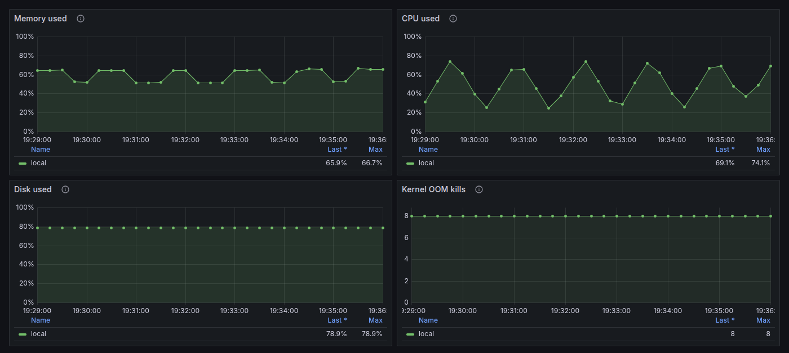
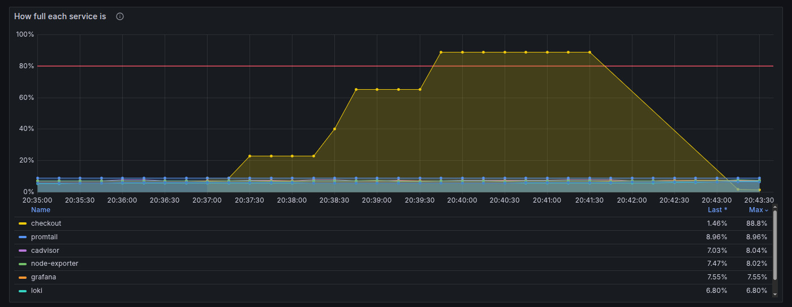
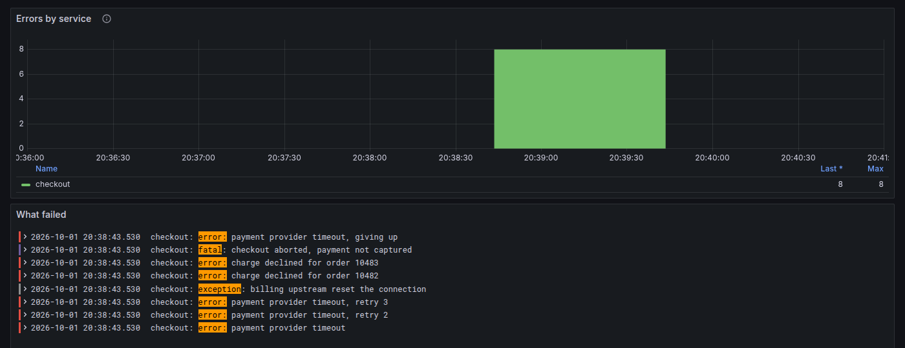

# Checkout is slow. You still do not know which of three things it is.

The page is slow, the customer retries, and Slack fills up. From the outside it is one incident. On the machine it is one of three:

- the server itself is out of room
- one container is about to hit its memory limit
- that service started logging errors

This install opens Grafana with those three answers already on screen. The name on the log line is the name on the chart. Copy `checkout` from a line, find `checkout` on the memory graph.

## The server

CPU on this host moved between 25% and 74% in seven minutes. Memory moved with it. Disk stayed at 79%. The kernel OOM counter did not climb. The pressure was the machine, and it was compute, not a process the kernel had started killing.



## The container

Checkout climbed through the red line at 80% and held near 89%. Promtail, Grafana, Loki, and the exporters stayed under 10%. One series crossed. That is the limit to raise.



## The errors

Same name, same minute. Eight payment failures, then the chart goes quiet. Each line starts with `checkout:`.



## What you get

| Today | After this is installed |
| --- | --- |
| You SSH in and guess which of the three it is | The screen already separates the server, the container, and the errors |
| The log says one name, the metric says another | `checkout` on the line is `checkout` on the chart |
| The dashboard lives in someone's browser | Grafana loads the three boards from git when it starts |
| A dashboard edit risks the metric history | Prometheus, Loki, and Grafana are separate stacks |

A read-only assistant can query the same boards. It starts with `--disable-write`, so it cannot edit them.

## See it locally

Grafana listens on `127.0.0.1:3000`. Login `admin` / `admin`. The first login offers a password change; Skip leaves it as `admin`. Change that password before the port is reachable from anywhere else.

```bash
./up.sh
./down.sh
```

`demo/checkout` prints a sample error so the log board is not empty. Remove that compose file when Promtail reads your own containers.

Copy `mcp/env.example` to `mcp/env` and put the Viewer token only there.

## How the stacks stay independent

A dashboard edit deploys only Grafana. Prometheus history stays where it is:

```bash
docker compose -f grafana/docker-compose.yaml up -d
```

On Swarm, each directory is its own stack. Prometheus, Loki, and Grafana stay on one node each (`node.labels.prometheus == true`, and the same for the other two), because a local volume does not follow the container. Prometheus also stays on a manager: that is where Swarm service discovery can read the Docker socket. See `prometheus/prometheus.swarm.yml`.

After a dashboard edit on Swarm, the config object needs a new name (`v1` to `v2`). Swarm keeps the old bytes until the name changes.

Loki keeps logs for 720 hours. The retention setting alone does not delete them; the compactor does. Prometheus keeps 30 days or 10 GB, whichever comes first.
